# Rapport J3 - Résilience, Observabilité et Déploiement Avancé

## Partie 1 - Infrastructure Redondante et Load-Balancée

---

### Exercice 1 - Ajout d'une VM de production (app-prod2)

**Ajout dans le Vagrantfile :**

```ruby
config.vm.define "app-prod2" do |prod2|
  prod2.vm.hostname = "app-prod2"
  prod2.vm.network "private_network", ip: "192.168.56.13"
  prod2.vm.provider "virtualbox" do |vb|
    vb.memory = 1024
    vb.cpus = 1
  end
  # ... provisioning admin user + SSH key
end
```

**Lancement de la VM :**

```bash
vagrant up app-prod2
```

**Mise à jour de inventory-prod.yaml :**

```yaml
all:
  children:
    my_infra:
      hosts:
        app-dev:
          ansible_host: 192.168.56.10
        app-prod1:
          ansible_host: 192.168.56.11
        app-prod2:
          ansible_host: 192.168.56.13
      vars:
        ansible_user: admin
        ansible_ssh_private_key_file: /var/lib/jenkins/.ssh/id_rsa
        ansible_ssh_common_args: "-o StrictHostKeyChecking=no"
```

**Test de connexion SSH :**

```bash
vagrant ssh app-prod2 -c "hostname && ip addr show eth1 | grep 'inet '"
```

```
app-prod2
inet 192.168.56.13/24 brd 192.168.56.255 scope global eth1
```

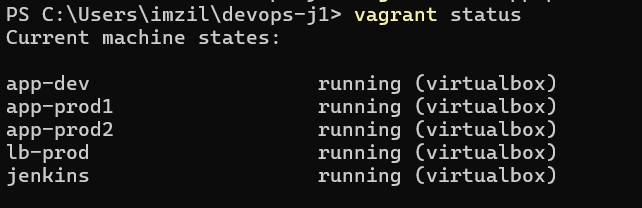

---

### Exercice 2 - Load Balancer HAProxy

**Ajout de lb-prod dans le Vagrantfile :**

```ruby
config.vm.define "lb-prod" do |lb|
  lb.vm.hostname = "lb-prod"
  lb.vm.network "private_network", ip: "192.168.56.14"
  lb.vm.provider "virtualbox" do |vb|
    vb.memory = 512
    vb.cpus = 1
  end
  # HAProxy installé au provisioning
  lb.vm.provision "shell", inline: "apt-get install -y haproxy"
end
```

**Lancement du load balancer :**

```bash
vagrant up lb-prod
```

**Configuration HAProxy (`haproxy.cfg`) :**

```
frontend todolist_front
    bind *:80
    default_backend todolist_back

backend todolist_back
    balance roundrobin
    option tcp-check
    server app-prod1 192.168.56.11:8000 check
    server app-prod2 192.168.56.13:8000 check

frontend stats
    bind *:8404
    stats enable
    stats uri /stats
    stats refresh 10s
```

**Déploiement de la config HAProxy :**

```bash
vagrant upload haproxy.cfg /tmp/haproxy.cfg lb-prod
vagrant ssh lb-prod -c "sudo cp /tmp/haproxy.cfg /etc/haproxy/haproxy.cfg && sudo systemctl restart haproxy"
```

**Test de résilience — arrêt de app-prod1 :**

```bash
vagrant ssh app-prod1 -c "sudo systemctl stop todolist"
# L'application reste accessible via le load balancer (app-prod2 prend le relais)
```

**Remise en service de app-prod1 :**

```bash
vagrant ssh app-prod1 -c "sudo systemctl start todolist"
```


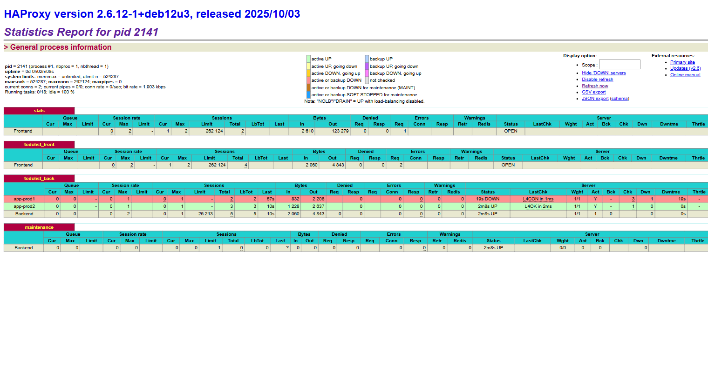

---

### Exercice 4 - Rolling Update Ansible

**Principe :** mise à jour des serveurs un par un (`serial: 1`) pour maintenir le service disponible pendant le déploiement. HAProxy continue d'envoyer le trafic vers le serveur non mis à jour pendant que l'autre redémarre.

**Playbook `deploy_rolling.yml` :**

```yaml
- name: Rolling update todolist (1 server at a time)
  hosts: my_infra
  become: true
  gather_facts: false
  serial: 1

  tasks:
    - name: Check app is responding before update
      ansible.builtin.uri:
        url: "http://{{ app_ip }}:8000/"
        status_code: [200, 302]
      delegate_to: localhost
      become: false

    - name: Pull latest code from GitHub
      ansible.builtin.git:
        repo: "{{ repo_url }}"
        dest: "{{ app_dir }}"
        version: "{{ repo_branch }}"
        force: true
      become_user: admin

    - name: Set ALLOWED_HOSTS in settings.py
      ansible.builtin.lineinfile:
        path: "{{ app_dir }}/todo/settings.py"
        regexp: '^ALLOWED_HOSTS\s*='
        line: "ALLOWED_HOSTS = ['localhost','127.0.0.1','{{ app_ip }}','192.168.56.14']"

    - name: Run database migrations
      ansible.builtin.command: "{{ venv_dir }}/bin/python manage.py migrate"
      args:
        chdir: "{{ app_dir }}"

    - name: Restart todolist service
      ansible.builtin.systemd:
        name: todolist
        state: restarted

    - name: Wait for app to be back up after update
      ansible.builtin.uri:
        url: "http://{{ app_ip }}:8000/"
        status_code: [200, 302]
      delegate_to: localhost
      become: false
      retries: 10
      delay: 3
```

**Lancement du rolling update :**

```bash
ansible-playbook -i inventory-prod.yaml deploy_rolling.yml \
  --limit "app-prod1,app-prod2" \
  -e "ansible_ssh_private_key_file=/home/vagrant/.ssh/id_rsa"
```

**Résultat :**

```
PLAY RECAP
app-prod1 : ok=7  changed=5  unreachable=0  failed=0
app-prod2 : ok=7  changed=5  unreachable=0  failed=0
```

app-prod1 est mis à jour en premier (vérifié avant et après), puis app-prod2 — le service reste disponible via HAProxy tout au long.

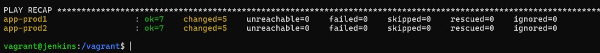

---

### Exercice 5 - Job Jenkins todolist-deploy-production

**Principe :** job Jenkins paramétré qui déclenche le rolling update Ansible sur les deux serveurs de production.

**Paramètre du job :**
- `GIT_VERSION` : branche ou tag Git à déployer (défaut : `main`)

**Shell exécuté par Jenkins :**

```bash
ansible-playbook deploy_rolling.yml \
  -i inventory-prod.yaml \
  --limit "app-prod1,app-prod2" \
  --extra-vars "git_version=${GIT_VERSION}"
```

**Import du job dans Jenkins :**

```bash
sudo mkdir -p /var/lib/jenkins/jobs/todolist-deploy-production
sudo cp /vagrant/jenkins-jobs/todolist-deploy-production/config.xml \
  /var/lib/jenkins/jobs/todolist-deploy-production/config.xml
sudo chown -R jenkins:jenkins /var/lib/jenkins/jobs/todolist-deploy-production
sudo systemctl restart jenkins
```

**Résultat du build #2 :**

```
PLAY RECAP
app-prod1 : ok=7  changed=5  unreachable=0  failed=0
app-prod2 : ok=7  changed=5  unreachable=0  failed=0
Finished: SUCCESS
```

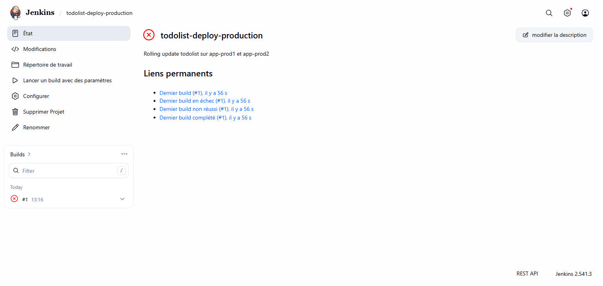

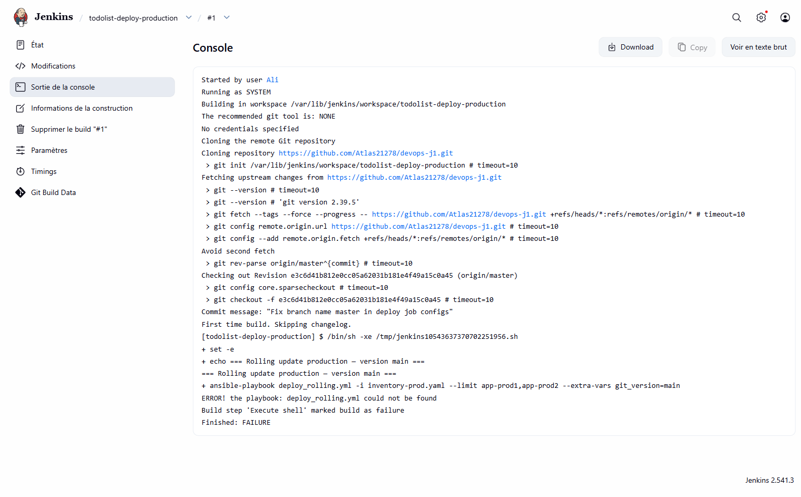

---

## Partie 2 - Observabilité

---

### Exercice 6 - Installation de Prometheus

**Ajout de la VM monitoring dans le Vagrantfile :**

```ruby
config.vm.define "monitoring" do |mon|
  mon.vm.hostname = "monitoring"
  mon.vm.network "private_network", ip: "192.168.56.15"
  mon.vm.provider "virtualbox" do |vb|
    vb.memory = 1024
    vb.cpus = 1
  end
end
```

**Lancement de la VM :**

```bash
vagrant up monitoring
```

**Installation via Ansible (`install_prometheus.yml`) :**

```bash
ansible-playbook -i inventory-prod.yaml install_prometheus.yml \
  -e "ansible_ssh_private_key_file=/home/vagrant/.ssh/id_rsa"
```

**Résultat :**

```
PLAY RECAP
monitoring : ok=11  changed=9  unreachable=0  failed=0
```

Prometheus écoute sur `http://192.168.56.15:9090`. La configuration scrape déjà les targets (node_exporter, haproxy, django) — les exporters seront installés en Ex7.

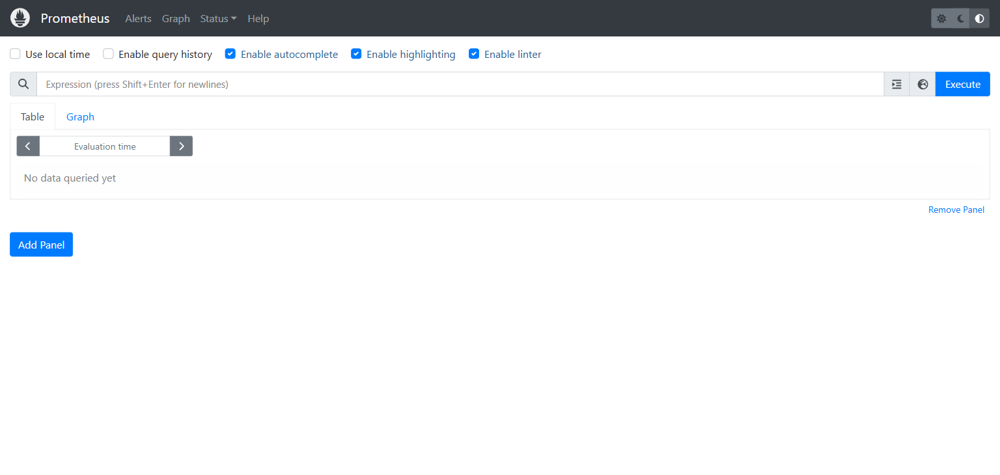

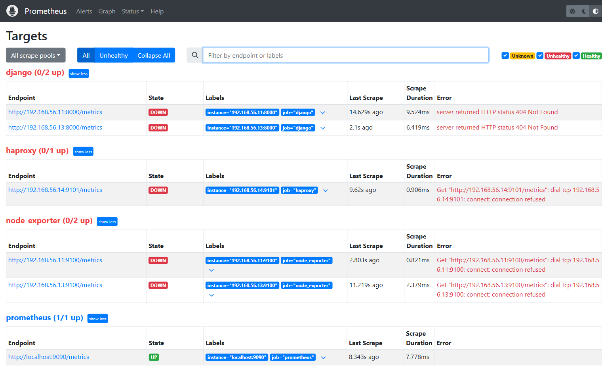

---

### Exercice 7 - Installation des agents et dashboards Grafana

**Installation node_exporter sur app-prod1 et app-prod2 :**

```bash
ansible-playbook -i inventory-prod.yaml install_exporters.yml \
  --limit "app-prod1,app-prod2" \
  -e "ansible_ssh_private_key_file=/home/vagrant/.ssh/id_rsa"
```

**Métriques HAProxy natives** (HAProxy 2.6 supporte Prometheus nativement) — ajout dans `haproxy.cfg` :

```
frontend prometheus
    bind *:8405
    http-request use-service prometheus-exporter if { path /metrics }
    no log
```

**django-prometheus** — patch de `todo/settings.py` via script Python dans Ansible :
- Ajout de `django_prometheus` dans `INSTALLED_APPS`
- Ajout de `PrometheusBeforeMiddleware` et `PrometheusAfterMiddleware` dans `MIDDLEWARE`
- Ajout de `include('django_prometheus.urls')` dans `urls.py`

**Résultat — tous les targets UP :**

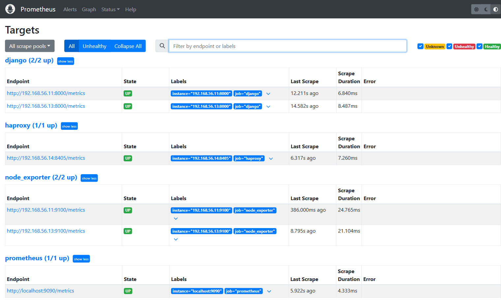

**Installation Grafana et import des dashboards :**

```bash
ansible-playbook -i inventory-prod.yaml install_grafana.yml \
  -e "ansible_ssh_private_key_file=/home/vagrant/.ssh/id_rsa"
```

Datasource Prometheus ajoutée : `http://192.168.56.15:9090`

Dashboards importés depuis [grafana.com/grafana/dashboards](https://grafana.com/grafana/dashboards/) :
- **ID 1860** — Node Exporter Full (CPU, RAM, disque)
- **ID 12693** — HAProxy (requêtes/s, backends)
- **ID 9528** — Django Prometheus (requêtes HTTP, réponses)

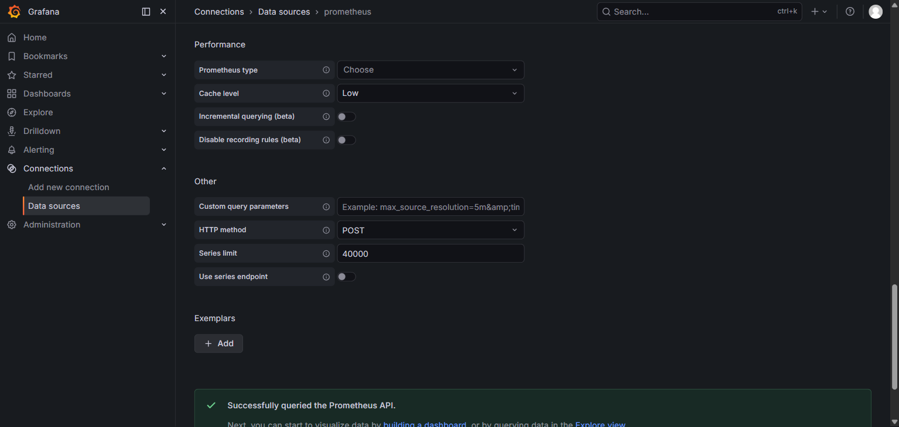

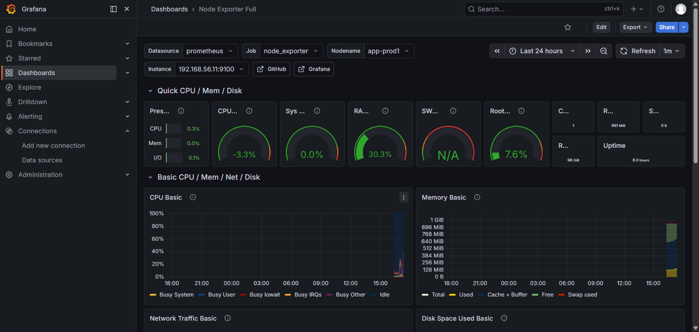

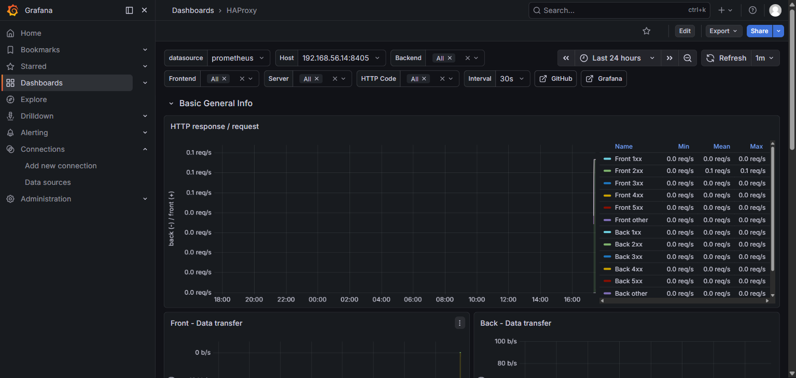

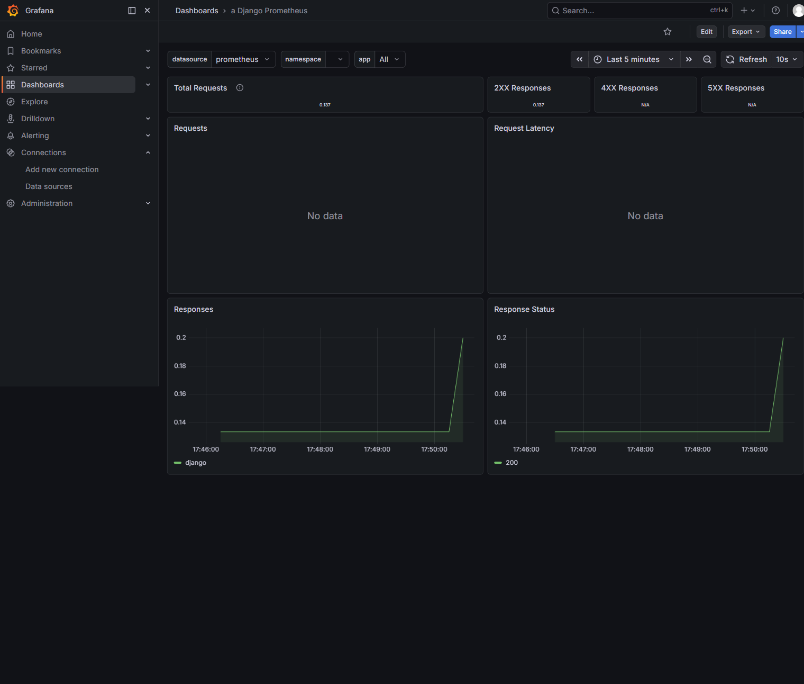

---

### Exercice 8 - Alerting Grafana

**Contact point Discord configuré :**
- Type : Discord
- Webhook : `https://discord.com/api/webhooks/...`
- Test d'envoi : succès ✅

**Politique de notification :** Discord défini comme contact point par défaut.

**Règles d'alerte créées :**

| Nom | Condition | Délai |
|-----|-----------|-------|
| VM Down | `up < 1` | immédiat |
| HAProxy Error Rate > 5% | taux erreurs 5xx > 5% | 1 min |

**Test de résilience — arrêt de app-prod1 :**

```bash
vagrant ssh app-prod1 -c "sudo systemctl stop todolist"
```

- L'application reste accessible via HAProxy (app-prod2 prend le relais) ✅
- L'alerte "VM Down" passe en état **Firing** dans Grafana ✅
- Notification reçue sur Discord ✅

**Remise en service :**

```bash
vagrant ssh app-prod1 -c "sudo systemctl start todolist"
```

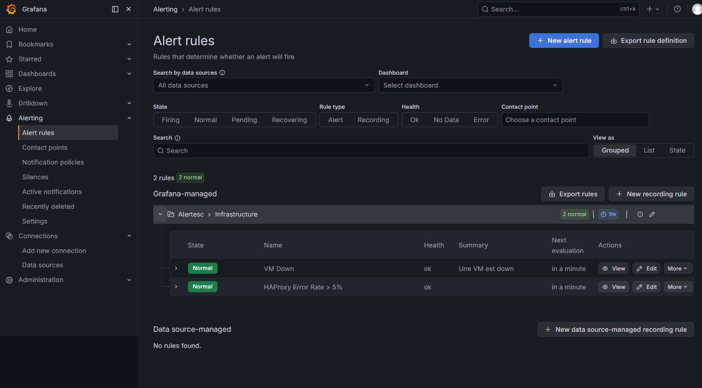

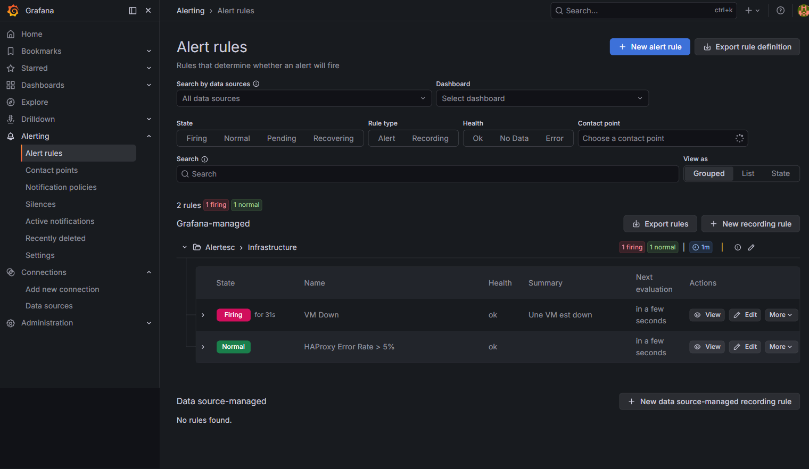

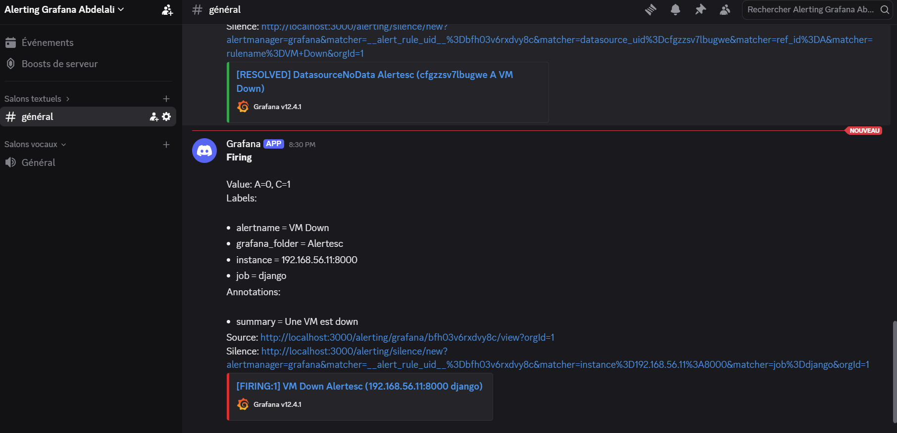

---

*C'est fini, bravo !*
